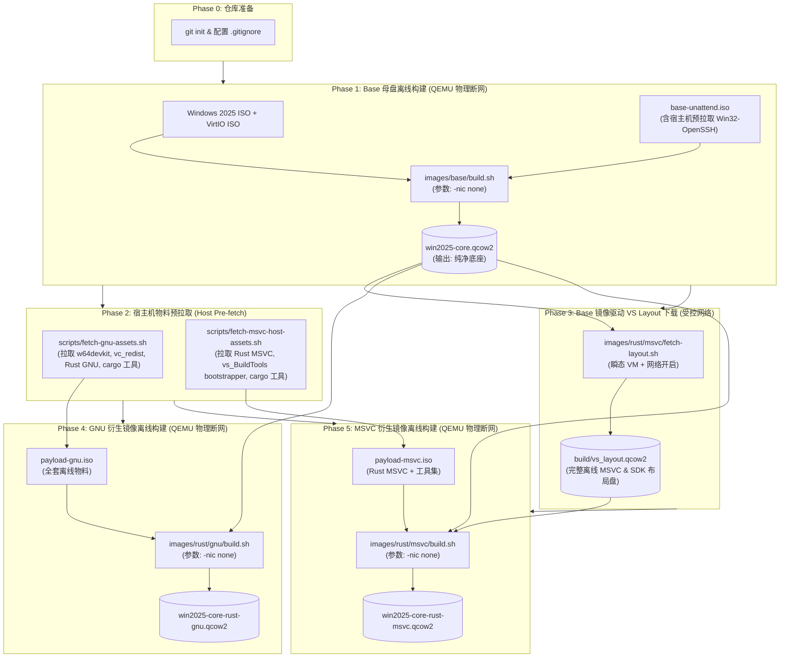
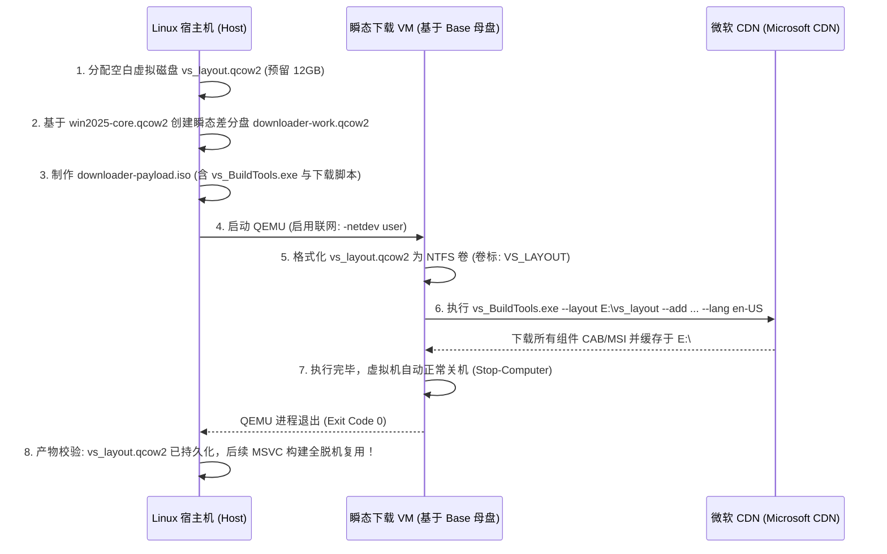

# Windows Server 2025 Core 树状镜像离线构建重构方案

> **文件标识**：`OFFLINE_BUILD_REFACTORING_PLAN.md`  
> **设计目标**：彻底禁止构建期间 QEMU 虚拟机内联网，所有外部依赖物料均在构建前拉取至宿主机，支持基于 Base 母盘构建产物以受控方式下载 Visual Studio Build Tools 离线布局，优先采用破坏性优化，实现 100% 确定性、高复用、高可靠的纯离线镜像构建流水线。  
> **执行约束**：本文件为纯设计实现方案，**当前阶段仅编写方案，不执行变更**。  

---

## 目录
1. [重构背景与核心原则](#1-重构背景与核心原则)
2. [总体架构与流水线设计](#2-总体架构与流水线设计)
3. [目标文件重构详细方案](#3-目标文件重构详细方案)
   - [3.1 images/base/build.sh](#31-imagesbasebuildsh)
   - [3.2 images/base/provision.ps1](#32-imagesbaseprovisionps1)
   - [3.3 images/base/provision-runner.ps1](#33-imagesbaseprovision-runnerps1)
   - [3.4 images/rust/gnu/build.sh](#34-imagesrustgnubuildsh)
   - [3.5 images/rust/gnu/provision.ps1](#35-imagesrustgnuprovisionps1)
   - [3.6 images/rust/msvc/build.sh](#36-imagesrustmsvcbuildsh)
   - [3.7 images/rust/msvc/provision.ps1](#37-imagesrustmsvcprovisionps1)
4. [VS BuildTools 离线布局下载器方案（Base镜像驱动）](#4-vs-buildtools-离线布局下载器方案base镜像驱动)
5. [宿主机物料统一预拉取机制 (Pre-fetcher)](#5-宿主机物料统一预拉取机制-pre-fetcher)
6. [Git 初始化与原子提交规划 (Traceability & Commit Plan)](#6-git-初始化与原子提交规划-traceability--commit-plan)
7. [关键技术风险与应对策略](#7-关键技术风险与应对策略)
8. [执行检查清单 (Execution Checklist)](#8-执行检查清单-execution-checklist)

---

## 1. 重构背景与核心原则

### 1.1 现状痛点
当前构建流水线存在以下脆弱点与稳定性风险：
1. **构建期虚拟机内联网（In-VM Online Fetch）**：
   - `images/rust/gnu/provision.ps1` 与 `images/rust/msvc/provision.ps1` 在 QEMU 内通过 SLIRP 网络直接调用 `Invoke-WebRequest`、`curl`、`rustup-init.exe` 和 `cargo-binstall` 下载依赖。
   - 依赖外部网络连通性，极易因 GitHub API 限流、Microsoft CDN 波动、DNS 解析超时导致长达数十分钟的构建在最后阶段失败。
   - 镜像构建过程不可审计、不具备幂等性（Idempotence）。
2. **VS BuildTools 难以在 Linux 宿主机原生下载**：
   - Visual Studio 2022 的组件依赖图非常复杂，官方唯一可靠的离线下载方式是通过 Windows 环境下的 `vs_BuildTools.exe --layout`。Linux 宿主机缺乏 Windows API 支持，无法直接生成原生完整 layout。
3. **网络设备冗余挂载**：
   - 基础母盘安装阶段（WinPE 和 FirstLogon）挂载了 `virtio-net-pci` 并配置了 `user,id=net0` 连网，存在意外网络泄露与外部访问隐患。

### 1.2 重构核心原则
1. **QEMU 构建物理级断网（Zero In-VM Build Network）**：
   - 所有镜像构建阶段（Base Stage 1/Stage 2、GNU Child、MSVC Child）一律移除外部网络设备，使用 `-nic none`，从虚拟机硬件层切断所有数据包出入。
2. **所有物料构建前完成拉取（All Assets Pre-fetched Outside QEMU）**：
   - 宿主机在启动 QEMU 构建前，负责拉取所有二进制工具、安装包与编译器。
   - 物料通过只读本地介质（Payload ISO / 附加只读 QCOW2 虚拟磁盘）注入虚拟机。
3. **受控利用 Base 镜像下载 VS BuildTools 离线组件（Base-driven VS Layout Fetcher）**：
   - 在 Base 母盘（`win2025-core.qcow2`）构建完成后，启动一个受控的独立瞬态下载器虚拟机（仅此阶段开放网络），运行 `vs_BuildTools.exe --layout` 将所有 MSVC 与 Win11 SDK 组件写入独立的虚拟磁盘（`vs_layout.qcow2`），完成后持久化缓存于宿主机。
   - 随后的 MSVC 镜像构建阶段则完全在离线状态下挂载该虚拟磁盘进行本地高速安装。
4. **优先破坏性更改（Embrace Breaking Changes）**：
   - 废除 provision 脚本中所有多余的网络重试、在线下载逻辑与死循环探测，全面转为“本地介质即插即用，缺失即刻硬报错（Fail-Fast）”。
   - 重构依赖注入路径，采用高效的预解包与二进制直接部署，大幅缩短虚拟机初始化时间。
5. **严密版本回溯与 Git 跟踪（Git Init & Atomic Commits）**：
   - 针对当前清空的 `.git`，在方案执行前完成 `git init`，执行过程中分阶段实施原子提交，确保每一项修改清晰可审计。

---

## 2. 总体架构与流水线设计

### 2.1 流水线拓扑结构


### 2.2 离线构建介质传递设计
| 镜像构建目标 | 介质类型 | 挂载方式 | 内容物与用途 |
| :--- | :--- | :--- | :--- |
| **Base 母盘** | CD-ROM 1<br/>CD-ROM 2<br/>CD-ROM 3 | `-drive file=...,media=cdrom` | 1. 微软官方安装盘 (`26100.1...ISO`)<br/>2. VirtIO 驱动光盘 (`virtio-win...iso`)<br/>3. 无人值守光盘 (`base-unattend.iso`，含 Autounattend.xml、宿主机预下载的 Win32-OpenSSH 离线安装包、调度器) |
| **GNU 镜像** | CD-ROM 1 | `-drive file=...,media=cdrom` | `payload-gnu.iso`（卷标 PROVISION）：<br/>- `child-provision.ps1`, `runner.ready`<br/>- `w64devkit.exe`<br/>- `vc_redist.x64.exe`<br/>- 预解包/归档的 Rust GNU 稳定版 (`rust-gnu/`)<br/>- `cargo-binstall.exe` 及 10 大常用工具预编译二进制 |
| **MSVC 镜像** | VirtIO 磁盘 1<br/>CD-ROM 1 | `-drive file=vs_layout.qcow2,if=virtio,readonly=on`<br/>`-drive file=payload-msvc.iso,media=cdrom` | 1. `vs_layout.qcow2`（卷标 VS_LAYOUT）：微软官方离线布局，含 VCTools、Win11 SDK 26100、UCRT<br/>2. `payload-msvc.iso`（卷标 PROVISION）：<br/>- `child-provision.ps1`, `runner.ready`<br/>- 预解包/归档的 Rust MSVC 稳定版 (`rust-msvc/`)<br/>- `cargo-binstall.exe` 及 10 大常用工具预编译二进制 |

---

## 3. 目标文件重构详细方案

### 3.1 `images/base/build.sh`

#### 破坏性改动要点
1. **彻底移除构建期网络设备**：
   - 将 Stage 1（WinPE 安装）与 Stage 2（FirstLogon 置备）中的 `-netdev user,id=net0` 与 `-device virtio-net-pci,netdev=net0` 彻底替换为 `-nic none`。
   - 杜绝安装阶段 Windows 尝试连接 Windows Update 或微软遥测。
2. **宿主机预拉取并集成离线 Win32-OpenSSH 载荷**：
   - 彻底废除微软系统 Capability（`Add-WindowsCapability`）及相关 FoD 补丁包。
   - 构建启动前由宿主机统一拉取官方 Win32-OpenSSH 发行包（`fetch_win32_openssh`），解压校验后压入 `base-unattend.iso` 的 `openssh/` 目录。
   - 若宿主机缺少该物料且无法获取，构建直接阻断失败，确保无网环境下 100% 确定性。
3. **规范化元数据输出**：
   - 元数据中保留 SSH 与 VirtIO 配置声明，明确标注文档为纯离线构建产物。

#### 核心代码替换示意
```bash
# === 改造前 ===
# Stage 1
qemu-system-x86_64 ... \
    -netdev user,id=net0 \
    -device virtio-net-pci,netdev=net0 \
    ...

# Stage 2
qemu-system-x86_64 ... \
    -netdev user,id=net0 \
    -device virtio-net-pci,netdev=net0 \
    ...

# === 改造后 ===
# Stage 1: 物理断网安装
qemu-system-x86_64 \
    -enable-kvm \
    -m "${MEMORY_MB}" \
    -smp "${CPUS}" \
    -cpu host,hv_relaxed,hv_spinlocks=0x1fff,hv_vapic,hv_time \
    -drive "file=${RAW_QCOW2},if=virtio,format=qcow2,cache=writeback" \
    -drive "file=${WIN_ISO},media=cdrom,index=1" \
    -drive "file=${VIRTIO_ISO},media=cdrom,index=2" \
    -drive "file=${UNATTEND_ISO},media=cdrom,index=3" \
    -nic none \
    -vnc "127.0.0.1:${VNC_PORT}" \
    -display none \
    -monitor "unix:${MONITOR_SOCK},server,nowait" \
    -boot order=d \
    -no-reboot

# Stage 2: 物理断网 FirstLogon 置备
qemu-system-x86_64 \
    -enable-kvm \
    -m "${MEMORY_MB}" \
    -smp "${CPUS}" \
    -cpu host,hv_relaxed,hv_spinlocks=0x1fff,hv_vapic,hv_time \
    -drive "file=${RAW_QCOW2},if=virtio,format=qcow2,cache=writeback" \
    -drive "file=${VIRTIO_ISO},media=cdrom,index=1" \
    -drive "file=${UNATTEND_ISO},media=cdrom,index=2" \
    -nic none \
    -vnc "127.0.0.1:${VNC_PORT}" \
    -display none \
    -monitor "unix:${MONITOR_SOCK},server,nowait" \
    -boot order=c
```

---

### 3.2 `images/base/provision.ps1`

#### 破坏性改动要点
1. **OpenSSH Server 纯离线安装适配（全面废除微软系统包）**：
   - 彻底移除 `Add-WindowsCapability` 及所有微软 Capability / FoD 逻辑，不再考虑使用微软包。
   - 直接从部署介质光盘（`$mediaDrive\openssh`）复制宿主机预下载的 Win32-OpenSSH 至 `C:\Program Files\OpenSSH`。
   - 本地调用 `install-sshd.ps1` 完成服务注册、自动生成主机密钥、配置服务开机自动启动、启动 `sshd` 服务并添加防火墙入站规则，失败即刻硬报错阻断流水线。
2. **剔除 Windows Update 联网服务相关等待**：
   - 提前禁用 Windows Update 服务 (`wuauserv`)，避免其在后台无网络环境下发起重试循环占用 CPU。

#### 核心代码替换示意
```powershell
# === 改造后 OpenSSH 离线安装逻辑 ===
Write-Host "`n[Step 4/5] Deploying OpenSSH Server from offline media..." -ForegroundColor Yellow

$offlineSshDir = "$mediaDrive\openssh"
$targetSshDir = "C:\Program Files\OpenSSH"

if (!(Test-Path "$offlineSshDir\install-sshd.ps1")) {
    throw "CRITICAL: Offline Win32-OpenSSH package not found on media: $offlineSshDir"
}

Write-Host "[Info] Deploying Win32-OpenSSH to $targetSshDir..."
if (Test-Path $targetSshDir) {
    Remove-Item -Path $targetSshDir -Recurse -Force -ErrorAction SilentlyContinue
}
Copy-Item -Path $offlineSshDir -Destination $targetSshDir -Recurse -Force

# Clear Read-Only attributes inherited from CD-ROM media
attrib.exe -r "$targetSshDir\*.*" /s
Get-ChildItem -Path $targetSshDir -Recurse -Force | ForEach-Object {
    if (!$_.PSIsContainer) {
        $_.IsReadOnly = $false
    }
}

Write-Host "[Info] Executing install-sshd.ps1..."
& "$targetSshDir\install-sshd.ps1"

# Update machine Path environment variable if needed
$machinePath = [System.Environment]::GetEnvironmentVariable("Path", [System.EnvironmentVariableTarget]::Machine)
if ($machinePath -notlike "*$targetSshDir*") {
    [System.Environment]::SetEnvironmentVariable("Path", "$machinePath;$targetSshDir", [System.EnvironmentVariableTarget]::Machine)
}
$env:Path = "$env:Path;$targetSshDir"

# Generate host keys if not present
if (Test-Path "$targetSshDir\ssh-keygen.exe") {
    Write-Host "[Info] Generating OpenSSH host keys..."
    & "$targetSshDir\ssh-keygen.exe" -A
}

# Repair host key and config permissions for service execution
if (Test-Path "$targetSshDir\FixHostFilePermissions.ps1") {
    Write-Host "[Info] Repairing OpenSSH host file permissions for service execution..."
    & "$targetSshDir\FixHostFilePermissions.ps1" -Confirm:$false
}

# Configure sshd service startup and start
Set-Service -Name sshd -StartupType Automatic
Start-Service -Name sshd

# Configure ssh-agent service startup and start
Set-Service -Name "ssh-agent" -StartupType Automatic -ErrorAction SilentlyContinue
Start-Service "ssh-agent" -ErrorAction SilentlyContinue

# Configure firewall rules
New-NetFirewallRule -Name 'OpenSSH-Server-In-TCP' -DisplayName 'OpenSSH Server (sshd)' -Enabled True -Direction Inbound -Protocol TCP -Action Allow -LocalPort 22 -Profile Any -ErrorAction SilentlyContinue
netsh advfirewall firewall add rule name="OpenSSH-Server-In-TCP" dir=in action=allow protocol=TCP localport=22 profile=any | Out-Null

$sshd = Get-Service -Name sshd -ErrorAction SilentlyContinue
if ($sshd -and $sshd.Status -eq 'Running') {
    Write-Host "[Success] OpenSSH Server deployed, started, and configured on port 22." -ForegroundColor Green
} else {
    throw "CRITICAL: OpenSSH Server (sshd) failed to start!"
}
```

---

### 3.3 `images/base/provision-runner.ps1`

#### 破坏性改动要点
1. **升级为多驱动器类型与多卷标扫描**：
   - 原脚本仅检索 `CD-ROM` 和 `Removable` 类型的卷；但在离线 MSVC 构建时，`vs_layout.qcow2` 是作为 VirtIO 虚拟磁盘（类型为 `Fixed`）挂载的。
   - 重构扫描逻辑：检索系统所有可用卷（排除 `C:` 盘），优先根据卷标 `PROVISION` 定位控制载荷盘，同时开放对包含 `child-provision.ps1` 的任何驱动器的识别。
2. **加入辅助载荷卷（如 VS_LAYOUT 驱动器）就绪状态透传**：
   - 记录所有已就绪的辅助介质盘符并输出到环境变量，便于子配置脚本直接调用。

#### 核心代码替换示意
```powershell
# === 改造后驱动器扫描逻辑 ===
$payloadDrive = $null
$layoutDrive = $null

for ($i = 1; $i -le 15; $i++) {
    $volumes = Get-Volume | Where-Object { $_.DriveLetter -and $_.DriveLetter -ne 'C' }
    
    # 查找主执行载荷盘 (PROVISION)
    $provVol = $volumes | Where-Object {
        (Test-Path "$($_.DriveLetter):\child-provision.ps1") -and (Test-Path "$($_.DriveLetter):\runner.ready")
    } | Select-Object -First 1
    
    # 查找可选的离线布局盘 (VS_LAYOUT)
    $layoutVol = $volumes | Where-Object {
        ($_.FileSystemLabel -eq 'VS_LAYOUT') -or (Test-Path "$($_.DriveLetter):\vs_BuildTools.exe")
    } | Select-Object -First 1

    if ($provVol) {
        $payloadDrive = "$($provVol.DriveLetter):"
        if ($layoutVol) { $layoutDrive = "$($layoutVol.DriveLetter):" }
        break
    }
    Write-Host "[Runner] Waiting for payload media to attach (attempt $i/15)..."
    Start-Sleep -Seconds 2
}

if (!$payloadDrive) {
    Write-Host "[Runner] No child provisioning payload detected. Exiting."
    Remove-Item -Force $lockFile -ErrorAction SilentlyContinue
    Stop-Transcript
    exit 0
}

Write-Host "[Runner] Main payload located at: $payloadDrive" -ForegroundColor Green
if ($layoutDrive) {
    Write-Host "[Runner] Detected offline VS layout disk at: $layoutDrive" -ForegroundColor Green
    $env:VS_LAYOUT_DRIVE = $layoutDrive
}
```

---

### 3.4 `images/rust/gnu/build.sh`

#### 破坏性改动要点
1. **宿主机端全要素物料预检与自动拉取 (Host Pre-fetch)**：
   - 将原来分散在 in-VM 内部下载的全部物料，提取为构建前在宿主机执行：
     - `w64devkit` (最新版)
     - `vc_redist.x64.exe` (微软最新运行时)
     - `rust-stable-x86_64-pc-windows-gnu.tar.gz` (官方独立工具链完整包)
     - `cargo-binstall` 及全部 10 大常用工具二进制 (`sccache`, `cargo-nextest`, `cargo-sweep`, `cargo-geiger`, `cargo-audit`, `flamegraph`, `samply`, `cargo-show-asm`, `cargo-expand`, `cargo-bloat`)
   - 宿主机完成解包与归整，统一放入 `payload_gnu_root`，通过 `make_iso` 一次性压入 `payload-gnu.iso`。
2. **QEMU 彻底物理断网**：
   - 移除 `-netdev user,id=net0` 与 `-device virtio-net-pci`，直接采用 `-nic none`。
3. **构建耗时由 ~25 分钟暴降至 ~2 分钟**：
   - 依赖本地 CD-ROM 极速总线拷贝，彻底告别虚拟机内部几十次握手、DNS 查询与下载重试。

#### 核心代码替换示意
```bash
# === 改造后 QEMU 调用部分 ===
log_step "[Phase 3/4] Launching Isolated Offline QEMU Provisioning..."
MONITOR_SOCK="${BUILD_DIR}/qemu-monitor-gnu.sock"
rm -f "${MONITOR_SOCK}"

qemu-system-x86_64 \
    -enable-kvm \
    -m "${MEMORY_MB}" \
    -smp "${CPUS}" \
    -cpu host,hv_relaxed,hv_spinlocks=0x1fff,hv_vapic,hv_time \
    -drive "file=${WORK_QCOW2},if=virtio,format=qcow2,cache=writeback" \
    -drive "file=${PAYLOAD_ISO},media=cdrom,index=1" \
    -nic none \
    -vnc "127.0.0.1:${VNC_PORT}" \
    -display none \
    -monitor "unix:${MONITOR_SOCK},server,nowait" \
    -boot order=c \
    -no-reboot
```

---

### 3.5 `images/rust/gnu/provision.ps1`

#### 破坏性改动要点
1. **彻底斩断所有网络函数与连网等待**：
   - 完全删除 `Invoke-StrictDownload` 函数。
   - 完全删除第 4 步中循环等待 `https://static.rust-lang.org` 的 20 次网络轮询代码。
   - 完全删除 GitHub API 动态版本解析网络请求。
2. **全流程本地介质离线解压部署**：
   - **Step 2 (MinGW-w64)**: 直接从 `$mediaDrive\w64devkit.exe` 离线静默展开到 `C:\tools\w64devkit`。
   - **Step 3 (VC++ Redist)**: 直接调用 `$mediaDrive\vc_redist.x64.exe /install /quiet /norestart`。
   - **Step 4 (Rust GNU Toolchain)**: 直接从 `$mediaDrive\rust-gnu\` 复制到 `C:\tools\rust`，本地执行 `rustup toolchain link stable C:\tools\rust` 并设置 `rustup default stable`。
   - **Step 5 (Cargo 工具箱)**: 直接从 `$mediaDrive\cargo-tools\` 批量拷贝 10 大工具可执行文件及 `cargo-binstall.exe` 至 `C:\Users\Administrator\.cargo\bin\`。
3. **保留完整的本地验证自检 (Self-Test)**：
   - 对本地部署完毕的 GCC、G++、Make、Rustc、Cargo、10 大工具进行真实编译和版本探测验证，确保离线产物功能 100% 达标。

---

### 3.6 `images/rust/msvc/build.sh`

#### 破坏性改动要点
1. **前置离线布局就绪性检查与自动调用**：
   - 在构建开始时检查 `build/vs_layout.qcow2`（或配置的持久化路径）是否存在。
   - 若不存在，自动调用 `images/rust/msvc/fetch-layout.sh`（见第 4 节）启动 Base 镜像驱动下载器，生成离线布局虚拟磁盘。
2. **双载荷离线挂载**：
   - **载荷 1 (VirtIO 驱动器)**: 挂载 `vs_layout.qcow2`（只读），作为离线 Visual Studio 安装源。
   - **载荷 2 (CD-ROM)**: 挂载 `payload-msvc.iso`，包含 Rust MSVC 工具链、`cargo-binstall`、10 大工具及 child-provision 脚本。
3. **QEMU 物理断网**：
   - 使用 `-nic none`，禁止任何内部网络流量。

#### 核心代码替换示意
```bash
# === 改造后 QEMU 调用部分 ===
log_step "[Phase 3/4] Launching Isolated Offline MSVC QEMU Provisioning..."
MONITOR_SOCK="${BUILD_DIR}/qemu-monitor-msvc.sock"
rm -f "${MONITOR_SOCK}"

# 挂载说明:
# index 0 (hda): 瞬态工作盘 (基于 Base 镜像的 CoW 差分盘)
# index 1 (hdb): VS BuildTools 离线布局盘 (只读 VirtIO 磁盘)
# cdrom 1:      Rust MSVC 与 Cargo 工具载荷 ISO
qemu-system-x86_64 \
    -enable-kvm \
    -m "${MEMORY_MB}" \
    -smp "${CPUS}" \
    -cpu host,hv_relaxed,hv_spinlocks=0x1fff,hv_vapic,hv_time \
    -drive "file=${WORK_QCOW2},if=virtio,format=qcow2,cache=writeback" \
    -drive "file=${VS_LAYOUT_QCOW2},if=virtio,format=qcow2,readonly=on" \
    -drive "file=${PAYLOAD_ISO},media=cdrom,index=1" \
    -nic none \
    -vnc "127.0.0.1:${VNC_PORT}" \
    -display none \
    -monitor "unix:${MONITOR_SOCK},server,nowait" \
    -boot order=c \
    -no-reboot
```

---

### 3.7 `images/rust/msvc/provision.ps1`

#### 破坏性改动要点
1. **彻底斩断网络与在线安装**：
   - 完全删除 `Invoke-StrictDownload` 及对 `https://aka.ms`、`https://static.rust-lang.org`、`https://github.com` 的所有网络轮询与等待。
2. **Visual Studio 2022 Build Tools 纯本地离线安装**：
   - 定位由 `provision-runner.ps1` 发现或卷标为 `VS_LAYOUT` 的磁盘盘符（例如 `D:` 或 `E:`）。
   - 执行官方离线静默安装参数，加入 `--noWeb` 标志，强制完全脱机安装：
     ```powershell
     $vsInstaller = "$layoutDrive\vs_BuildTools.exe"
     $vsArgs = @(
         "--quiet",
         "--wait",
         "--norestart",
         "--nocache",
         "--noWeb",
         "--noUpdateInstaller",
         "--installPath", "C:\BuildTools",
         "--add", "Microsoft.VisualStudio.Workload.VCTools",
         "--add", "Microsoft.VisualStudio.Component.VC.Tools.x86.x64",
         "--add", "Microsoft.VisualStudio.Component.Windows11SDK.26100",
         "--add", "Microsoft.Component.VC.Runtime.UCRTSDK"
     )
     $proc = Start-Process -FilePath $vsInstaller -ArgumentList $vsArgs -Wait -PassThru -NoNewWindow
     ```
3. **Rust MSVC 与 Cargo 生态工具直接脱机装配**：
   - 从 `$mediaDrive\rust-msvc` 展开完整 MSVC ABI 编译器与工具链。
   - 直接部署 10 大常用工具二进制，完成环境变量与 MSVC 编译环境（`vcvars64.bat`）全局持久化。
4. **自检与收敛**：
   - 运行本地 `cl.exe`、`link.exe`、`vswhere.exe`、`rustc`、`cargo` 编译测试，执行磁盘精简后安全关机。

---

## 4. VS BuildTools 离线布局下载器方案（Base镜像驱动）

本方案严格遵守用户要求：**“允许在base镜像构建后使用base构建镜像下载vs_BuildTools的各组件”**。

### 4.1 设计原理与工作流程
由于微软 Visual Studio 的离线缓存机制必须依赖 Windows 宿主 API 解析 catalog 清单，我们在 Base 母盘生成后，引入一个**一次性/受控的布局下载器流水线**：



### 4.2 脚本设计：`images/rust/msvc/fetch-layout.sh`
- **目标产物**：`build/vs_layout.qcow2`（或可归档至持久化包缓存 `packages/vs_layout.qcow2`）
- **核心特性**：
  - **幂等性**：若本地已存在合法的 `vs_layout.qcow2`，自动跳过下载。
  - **不污染母盘**：基于 `win2025-core.qcow2` 创建临时 CoW 差分层，下载结束后直接销毁差分层，母盘始终保持纯净只读。
  - **独立隔离**：该过程为前置准备阶段，与后续镜像构建阶段严格解耦。真正的 MSVC 镜像构建阶段中，QEMU 严禁联网。

### 4.3 下载器内部 PowerShell 执行逻辑 (`download-layout.ps1`)
```powershell
$ErrorActionPreference = "Stop"
Start-Transcript -Path "C:\vs-layout-download.log" -Append

Write-Host "=== VS BuildTools Layout Downloader (Running inside Base VM) ===" -ForegroundColor Cyan

# 1. 寻找未格式化的辅助磁盘并初始化
$targetDisk = Get-Disk | Where-Object { $_.PartitionStyle -eq 'RAW' } | Select-Object -First 1
if ($targetDisk) {
    Write-Host "[Disk] Initializing layout disk $($targetDisk.Number)..."
    Initialize-Disk -Number $targetDisk.Number -PartitionStyle MBR
    $partition = New-Partition -DiskNumber $targetDisk.Number -UseMaximumSize -AssignDriveLetter
    Format-Volume -Partition $partition -FileSystem NTFS -NewFileSystemLabel "VS_LAYOUT" -Confirm:$false
    $layoutDrive = $partition.DriveLetter + ":"
} else {
    $vol = Get-Volume | Where-Object { $_.FileSystemLabel -eq "VS_LAYOUT" } | Select-Object -First 1
    $layoutDrive = $vol.DriveLetter + ":"
}
Write-Host "[Disk] Target layout destination: $layoutDrive"

# 2. 调用 vs_BuildTools 制作完整离线布局
$vsExe = "C:\Windows\Temp\vs_BuildTools.exe"
if (!(Test-Path $vsExe)) {
    # 从 payload 光盘载入 bootstrapper
    Copy-Item "D:\vs_BuildTools.exe" $vsExe -Force
}

$layoutArgs = @(
    "--layout", $layoutDrive,
    "--add", "Microsoft.VisualStudio.Workload.VCTools",
    "--add", "Microsoft.VisualStudio.Component.VC.Tools.x86.x64",
    "--add", "Microsoft.VisualStudio.Component.Windows11SDK.26100",
    "--add", "Microsoft.Component.VC.Runtime.UCRTSDK",
    "--lang", "en-US",
    "--quiet"
)

Write-Host "[Download] Starting layout creation from Microsoft CDN..."
$proc = Start-Process -FilePath $vsExe -ArgumentList $layoutArgs -Wait -PassThru -NoNewWindow
if ($proc.ExitCode -ne 0 -and $proc.ExitCode -ne 3010) {
    throw "Layout download failed with code $($proc.ExitCode)"
}

Write-Host "[Success] Layout creation completed successfully. Shutting down." -ForegroundColor Green
Stop-Transcript
Start-Sleep -Seconds 3
Stop-Computer -Force
```

---

## 5. 宿主机物料统一预拉取机制 (Pre-fetcher)

为了彻底践行“所有文件均需要构建前拉取”，在宿主机建立 `scripts/fetch-common-assets.sh` 与针对各工具链的拉取模块。

### 5.1 宿主机统一拉取物料清单与规格
所有文件统一缓存在宿主机 `${WORKSPACE_DIR}/packages/` 目录下（受 `.gitignore` 保护，支持跨次构建秒级缓存）：

| 物料类别 | 物料名称 | 宿主机拉取方式 | 目标传递介质 |
| :--- | :--- | :--- | :--- |
| **远程服务** | `OpenSSH-Win64.zip` | 宿主机从 GitHub PowerShell/Win32-OpenSSH Releases 下载并解压至 `packages/openssh` | `base-unattend.iso` |
| **基础依赖** | `vc_redist.x64.exe` | `curl -fsSL https://aka.ms/vs/17/release/vc_redist.x64.exe` | `payload-gnu.iso`<br/>`payload-msvc.iso` |
| **GNU 编译器** | `w64devkit-x64-${VER}.7z.exe` | 宿主机解析 GitHub Latest Release API 并下载 | `payload-gnu.iso` |
| **Rust GNU** | `rust-stable-x86_64-pc-windows-gnu.tar.gz` | 从 `static.rust-lang.org/dist/channel-rust-stable.toml` 动态解析最新稳定版并下载 | `payload-gnu.iso` (在宿主机解压/归档) |
| **Rust MSVC** | `rust-stable-x86_64-pc-windows-msvc.tar.gz` | 从 `static.rust-lang.org/dist/channel-rust-stable.toml` 动态解析最新稳定版并下载 | `payload-msvc.iso` (在宿主机解压/归档) |
| **Cargo 工具分发器** | `cargo-binstall-x86_64-pc-windows-msvc.zip` | 宿主机从 GitHub Releases 下载最新发行包并解压出可执行文件 | `payload-gnu.iso`<br/>`payload-msvc.iso` |
| **10 大 Cargo 预编译工具** | `sccache`, `cargo-nextest`, `cargo-sweep`, `cargo-geiger`, `cargo-audit`, `flamegraph`, `samply`, `cargo-asm`, `cargo-expand`, `cargo-bloat` | 宿主机脚本并发从各自官方 GitHub Releases 拉取 Windows 预编译二进制归档，并提取 `.exe` | `payload-gnu.iso`<br/>`payload-msvc.iso` |
| **VS Bootstrapper** | `vs_BuildTools.exe` | `curl -fsSL https://aka.ms/vs/17/release/vs_BuildTools.exe` | 用于注入 VS 布局下载器 |
| **VS 完整组件布局** | `vs_layout.qcow2` | 由 Phase 3（Base 驱动的下载 VM）产出 | 附加 VirtIO 虚拟磁盘 |

---

## 6. Git 初始化与原子提交规划 (Traceability & Commit Plan)

根据用户指令：**“当前.git文件夹已清空，在执行方案前初始化git，执行过程中需要commit修改以保证可回溯、可跟踪。”**

本节为后续实施执行阶段制定精确的 Git 初始化及阶段性原子 Commit 清单。

### 6.1 执行前初始状态准备
在着手修改任何代码文件之前，必须先在 `/workspace` 根目录下完成 Git 初始化并保存当前基线状态：
```bash
# 1. 初始化 Git 仓库并设置默认主分支
cd /workspace
git init -b main

# 2. 配置基础 Git 用户信息 (保障本地可回溯性)
git config user.name "ImagePipelineBuilder"
git config user.email "builder@pipeline.local"

# 3. 完善 .gitignore，确保重型构建缓存不污染版本库
cat << 'GITIGNORE_EOF' > /workspace/.gitignore
ISO/
output/
build/
packages/
.devbox/
*.qcow2
*.iso
*.sock
*.log
GITIGNORE_EOF

# 4. 提交当前重构前基线快照 (Commit 0)
git add .
git commit -m "chore(baseline): snapshot codebase before offline build refactoring"
```

### 6.2 执行过程中的原子提交序列 (Atomic Commit Sequence)
在实际代码实现阶段，严禁一次性大杂烩提交，必须按以下 7 个原子 Commit 循序渐进：

- **Commit 1: `refactor(base): isolate QEMU network and enable offline provisioning`**
  - 修改范围：
    - `images/base/build.sh`：移除 `-netdev` 和 `virtio-net-pci`，引入 `-nic none`，构建前由宿主机拉取 Win32-OpenSSH 并打包至 Unattend ISO。
    - `images/base/provision.ps1`：彻底弃用微软 Windows Capability，采用宿主机预下载的 Win32-OpenSSH 进行纯离线安装。
  - 验证点：Base 构建配置符合物理断网规范，OpenSSH 离线载荷就绪。

- **Commit 2: `refactor(runner): enhance provision runner for multi-drive and offline media detection`**
  - 修改范围：
    - `images/base/provision-runner.ps1`：扩展驱动器类型识别，增加 `PROVISION` 与 `VS_LAYOUT` 多卷匹配与环境变量导出。
  - 验证点：Runner 支持同时识别 CD-ROM 与 Fixed VirtIO 数据磁盘。

- **Commit 3: `feat(prefetch): add host-side asset downloaders and caching mechanism`**
  - 修改范围：
    - 新增 `scripts/fetch-common.sh`、`scripts/fetch-gnu-assets.sh`、`scripts/fetch-msvc-assets.sh`。
    - 在宿主机实现全套物料（w64devkit, vc_redist, Rust, 10 大工具）动态下载与校验。
  - 验证点：宿主机可脱机组装完整的 `payload_root` 目录。

- **Commit 4: `feat(vs-layout): implement base-image-driven VS BuildTools layout generator`**
  - 修改范围：
    - 新增 `images/rust/msvc/fetch-layout.sh` 及配套下载引导应答脚本。
    - 实现基于 `win2025-core.qcow2` 瞬态 VM 下载 VS 离线组件至 `vs_layout.qcow2` 的自动化流程。
  - 验证点：可自动化生成包含完整 MSVC + Win11 SDK 离线包的虚拟磁盘。

- **Commit 5: `refactor(rust-gnu): convert GNU child build to 100% offline workflow`**
  - 修改范围：
    - `images/rust/gnu/build.sh`：移除 QEMU 网络，接入宿主机预取物料打包流程。
    - `images/rust/gnu/provision.ps1`：彻底删除 `Invoke-StrictDownload` 与连网轮询，实现纯本地介质展开与离线自验。
  - 验证点：GNU 镜像在断网环境下极速装配完成。

- **Commit 6: `refactor(rust-msvc): convert MSVC child build to 100% offline workflow`**
  - 修改范围：
    - `images/rust/msvc/build.sh`：以 `-nic none` 启动 QEMU，并联挂载 `vs_layout.qcow2` 与 `payload-msvc.iso`。
    - `images/rust/msvc/provision.ps1`：使用 `--noWeb` 基于离线布局盘本地安装 VS，完成离线 Rust MSVC 工具链部署与自检。
  - 验证点：MSVC 镜像在断网环境下完全脱机完成装配与工具自检。

- **Commit 7: `chore(orchestration): update build scripts, devbox commands, and documentation`**
  - 修改范围：
    - 更新 `scripts/build.sh`、`devbox.json` 与 `README.md`，增加 `devbox run fetch:assets` 等新命令与架构图更新。
  - 验证点：全局构建命令 `scripts/build.sh all` 可一键顺畅端到端执行。

---

## 7. 关键技术风险与应对策略

### 7.1 风险 1：OpenSSH 在 Windows Server 2025 Core 无网环境下安装失败
- **风险分析**：
  1. Windows Server 2025 Core 默认未在本地 WinSxS 缓存 OpenSSH 服务端。若使用微软系统的 `Add-WindowsCapability -Online`，即使加 `-LimitAccess` 也会因为本地缺少 FoD 源而失败；若不加 `-LimitAccess` 则会在无网环境下超时卡死。
  2. 从 ISO 光盘复制 Win32-OpenSSH 时，Windows 会保留只读属性（ReadOnly）。若直接运行 `install-sshd.ps1`，脚本尝试修改 `openssh-events.man` 清单时会抛出 `Access to the path ... is denied`。
  3. `ssh-keygen -A` 生成的主机私钥默认继承了当前用户访问权限，OpenSSH 安全机制要求私钥仅限 SYSTEM/管理员容器访问，否则 Windows 服务控制管理器（SCM）启动 `sshd` 时会异常终止。
- **应对方案**：
  1. 彻底不再考虑使用微软的 Windows Capability / 系统包。
  2. 统一由宿主机在构建启动前从官方 GitHub Releases 拉取最新构建好的 `Win32-OpenSSH`（x64），解压验证后打入 `base-unattend.iso`。
  3. 在 `provision.ps1` 中从部署介质拷贝部署后，立即递归清除只读属性（`attrib.exe -r` 与 `$_.IsReadOnly = $false`）。
  4. 执行 `install-sshd.ps1` 后，生成主机私钥并显式运行 `FixHostFilePermissions.ps1 -Confirm:$false` 修复私钥 ACL，确保 `sshd` 服务可顺利启动并常驻。
  5. 在 `run-provision.cmd` 中增加非零退出码兜底关机机制，杜绝异常时虚拟机卡死。

### 7.2 风险 2：VS BuildTools `--layout` 产物体积与磁盘空间分配
- **风险现象**：VS BuildTools 的 VCTools + Win11 SDK 完整布局体积约为 3.5GB ~ 5GB。若预置磁盘空间不足会导致下载中断。
- **应对预案**：
  - 下载器创建的 `vs_layout.qcow2` 虚拟磁盘预分配容量设为 **12GB**，采用 QCOW2 稀疏文件格式（初始占用仅数兆，按需动态增长）。
  - 下载参数使用 `--lang en-US` 限制语言包，仅抓取 x64 核心编译组件，精简不必要的跨平台架构包。

### 7.3 风险 3：多虚拟磁盘挂载时的盘符漂移 (Drive Letter Drift)
- **风险现象**：在 MSVC 镜像构建时，QEMU 同时挂载了工作系统盘、VS 布局磁盘以及 Payload CD-ROM。Windows 动态分配的驱动器盘符（如 `D:`、`E:`、`F:`）可能发生漂移。
- **应对预案**：
  - 严禁硬编码驱动器盘符。
  - 格式化布局磁盘时指定显式卷标 `VS_LAYOUT`，Payload 光盘指定显式卷标 `PROVISION`。
  - 在 `provision-runner.ps1` 与 `provision.ps1` 中，统一通过 `Get-Volume | Where-Object { $_.FileSystemLabel -eq ... }` 或特征文件（`vs_BuildTools.exe`、`child-provision.ps1`）动态解析真实盘符。

### 7.4 风险 4：Rustup 在离线环境下的工具链导入
- **风险现象**：`rustup-init.exe` 默认强依赖远端 HTTP(S) channel-rust-stable 索引，离线执行默认会中断。
- **应对预案**：
  - 宿主机端下载官方独立分发的 `rust-stable-x86_64-pc-windows-gnu.tar.gz` 与 `rust-stable-x86_64-pc-windows-msvc.tar.gz`。
  - 离线阶段将解压后的文件直接部署于 `C:\tools\rust`，直接将其 `bin` 路径加入系统环境变量 `PATH`。
  - 同时调用 `rustup-init.exe -y --default-toolchain none` 仅初始化本地客户端代理，并执行 `rustup toolchain link stable C:\tools\rust`，实现 `rustup` 与直接二进制调用的双向完全兼容。

---

## 8. 执行检查清单 (Execution Checklist)

本清单用于后续方案获批进入执行阶段时的逐步核查与指导：

- [ ] **步骤 1：环境与版本控制基线建立**
  - [ ] 执行 `git init -b main`。
  - [ ] 配置 `.gitignore` 并完成 Commit 0。
- [ ] **步骤 2：重构 Base 母盘构建体系**
  - [ ] 修改 `images/base/build.sh`：Stage 1/2 启用 `-nic none`，前置拉取 Win32-OpenSSH 打包入光盘。
  - [ ] 修改 `images/base/provision.ps1`：废除微软系统包，直接离线安装宿主机预置的 Win32-OpenSSH。
  - [ ] 修改 `images/base/provision-runner.ps1`：支持多磁盘与卷标探测。
  - [ ] 执行 Commit 1 和 Commit 2。
- [ ] **步骤 3：开发宿主机预取器与 VS 布局下载器**
  - [ ] 实现 `scripts/fetch-common.sh`、`scripts/fetch-gnu-assets.sh`。
  - [ ] 实现 `images/rust/msvc/fetch-layout.sh`（Base 驱动的下载 VM）。
  - [ ] 执行 Commit 3 和 Commit 4。
- [ ] **步骤 4：重构 Rust GNU 镜像构建**
  - [ ] 修改 `images/rust/gnu/build.sh`：接入宿主机预取物料，启用 `-nic none`。
  - [ ] 修改 `images/rust/gnu/provision.ps1`：剔除所有网络逻辑，纯本地部署。
  - [ ] 执行 Commit 5。
- [ ] **步骤 5：重构 Rust MSVC 镜像构建**
  - [ ] 修改 `images/rust/msvc/build.sh`：挂载 `vs_layout.qcow2`，启用 `-nic none`。
  - [ ] 修改 `images/rust/msvc/provision.ps1`：使用 `--noWeb` 本地离线安装 VS。
  - [ ] 执行 Commit 6。
- [ ] **步骤 6：全局编排与端到端脱机验证**
  - [ ] 更新 `scripts/build.sh` 与 `devbox.json`。
  - [ ] 执行 Commit 7。
  - [ ] 验证：在宿主机断开外网状态下触发镜像构建，确认全流程零网络请求成功产出镜像。
