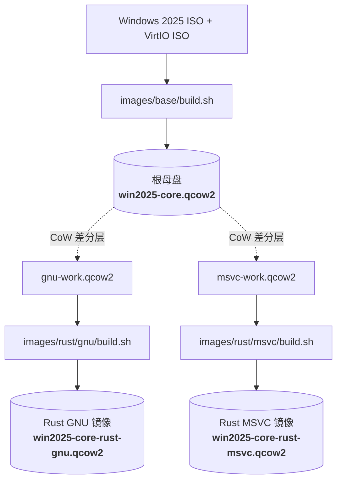

# Windows Server 2025 Core 树状镜像构建工程

## 1. 项目简介
本工程用于在 NixOS (含 QEMU / KVM) 宿主环境下，基于官方 Windows Server 2025 Standard Core 镜像与 VirtIO 驱动集合包，采用**树状分层构建（Hierarchical Tree Image Architecture）**体系，自动化产出轻量化、高性能的 QCOW2 虚拟机镜像。

镜像树结构如下：
- **根母盘**：`output/win2025-core.qcow2`（纯净系统底座，含 VirtIO 驱动、Guest Agent、OpenSSH Server、下游配置引导器）
- **GNU 衍生镜像**：`output/win2025-core-rust-gnu.qcow2`（基于母盘秒级派生，集成 w64devkit MinGW-w64 与 `x86_64-pc-windows-gnu` 工具链）
- **MSVC 衍生镜像**：`output/win2025-core-rust-msvc.qcow2`（基于母盘秒级派生，集成 Visual Studio 2022 Build Tools 与 `x86_64-pc-windows-msvc` 工具链）



## 2. 核心特性
- **操作系统底座**：Windows Server 2025 ServerStandardCore (Build 26100.1，纯 Core 模式，无 GUI 桌面)。
- **Copy-on-Write 增量隔离**：构建子镜像时母盘只读保护，通过 QCOW2 差分工作盘进行软件注入，即使子构建失败也绝不污染母盘。
- **双工具链生态支持**：
  - **GNU**：内置便携版 w64devkit (GCC, Binutils, Make) 及 `x86_64-pc-windows-gnu`，完全摆脱 MSVC 依赖。
  - **MSVC**：内置 Visual Studio 2022 Build Tools (MSVC `cl.exe`, `link.exe`, Windows SDK) 及 `x86_64-pc-windows-msvc`，满足原生 Windows ABI 需求。
- **通用下游调度器（Provision Runner）**：母盘开机自检挂载的光盘载荷，实现下游脚本秒级自动触发、验证与关机，彻底解耦网络握手。
- **全自动化运维**：集成 VirtIO Guest Tools (QEMU Guest Agent, NetKVM, Balloon)、默认开启 OpenSSH 服务 (端口 22)，并在收敛前执行磁盘 Trim 与 zlib 高压缩比置备。

## 3. 依赖规范与物料准备
### 3.1 宿主机依赖
- Linux/NixOS 系统级 QEMU (`qemu-system-x86_64`, `qemu-img`，需启用 `/dev/kvm` 硬件加速)。
- 辅助依赖通过 `devbox.json` 统一管理：
  - `cdrkit` (`genisoimage` 打包辅助光盘)
  - `wimlib` (WIM/ESD 检查工具)
  - `dos2unix` (Windows 换行符转换)

### 3.2 输入物料
- `ISO/26100.1_SERVERSTANDARD_X64_EN-US.ISO` (Windows Server 2025 Standard 镜像)
- `ISO/virtio-win-0.1.302.iso` (VirtIO 驱动集合包)
- `packages/` 离线缓存（可选，在线模式会自动下载）：
  - `rustup-init.exe`
  - `w64devkit-x64-2.9.1.7z.exe`
  - `vs_BuildTools.exe`

## 4. 目录结构说明
```
.
├── ISO/                                 # 原始输入光盘 (Windows ISO + VirtIO ISO)
├── packages/                            # 本地工具包离线缓存 (支持全局或各子镜像按需存放)
├── images/                              # 模块化镜像定义目录
│   ├── base/                            # 根母盘定义 (win2025-core.qcow2)
│   │   ├── Autounattend.xml             # WinPE 无人值守应答
│   │   ├── build.sh                     # 母盘独立构建脚本
│   │   ├── provision.ps1                # 母盘初始化脚本 (VirtIO, SSH, Runner)
│   │   ├── provision-runner.ps1         # 母盘通用下游调度器
│   │   └── README.md                    # 母盘详细说明
│   └── rust/
│       ├── gnu/                         # Rust GNU 衍生镜像定义
│       │   ├── build.sh                 # GNU 衍生镜像独立构建脚本
│       │   ├── provision.ps1            # w64devkit + Rust GNU 软件栈部署与自验
│       │   └── README.md                # GNU 镜像规格与使用说明
│       └── msvc/                        # Rust MSVC 衍生镜像定义
│           ├── build.sh                 # MSVC 衍生镜像独立构建脚本
│           ├── provision.ps1            # VS Build Tools + Rust MSVC 部署与自验
│           └── README.md                # MSVC 镜像规格与使用说明
├── scripts/                             # 通用编排与辅助脚本
│   ├── common.sh                        # 公共变量、路径定义与通用函数库
│   ├── monitor-boot.py                  # ISO 引导按键辅助监控
│   └── build.sh                         # 全局统一编排入口
├── output/                              # 最终交付镜像与 JSON 元数据
├── devbox.json                          # Devbox 环境与任务定义
└── docker-compose.yml                   # 容器化环境编排
```

## 5. 构建与使用指南

### 5.1 构建命令
在项目根目录下通过 Devbox 执行构建：
```bash
# 构建整棵镜像树 (Base -> Rust GNU -> Rust MSVC)
devbox run build

# 或仅构建根母盘
devbox run build:base

# 或仅构建指定衍生镜像 (母盘不存在时会自动先构建母盘)
devbox run build:gnu
devbox run build:msvc
```

也可直接调用各模块自身的构建脚本：
```bash
# 独立构建对应镜像
bash images/base/build.sh
bash images/rust/gnu/build.sh
bash images/rust/msvc/build.sh

# 快速差分开发模式 (保留轻量级 CoW 差分层)
bash images/rust/gnu/build.sh --overlay-only
bash images/rust/msvc/build.sh --overlay-only
```

或使用全局编排脚本统一调度：
```bash
bash scripts/build.sh all
bash scripts/build.sh base
bash scripts/build.sh gnu
bash scripts/build.sh msvc
bash scripts/build.sh gnu --overlay-only
```

### 5.2 产物规格
| 镜像文件 | 元数据文件 | 格式 | 压缩体积 | 登录凭据 | 工具链特性 |
| :--- | :--- | :--- | :--- | :--- | :--- |
| `output/win2025-core.qcow2` | `output/win2025-core.json` | QCOW2 | ~4.2G | Administrator / Admin1234! | 纯净底座、VirtIO、OpenSSH |
| `output/win2025-core-rust-gnu.qcow2` | `output/win2025-core-rust-gnu.json` | QCOW2 | ~5.5G | Administrator / Admin1234! | GCC 15 + Rust GNU 稳定版 |
| `output/win2025-core-rust-msvc.qcow2` | `output/win2025-core-rust-msvc.json` | QCOW2 | ~8.5G | Administrator / Admin1234! | MSVC 2022 + WinSDK + Rust MSVC |

### 5.3 虚拟机启动示例
以启动 Rust GNU 镜像为例：
```bash
qemu-system-x86_64 \
    -enable-kvm \
    -m 4096 \
    -smp 4 \
    -cpu host \
    -drive file=output/win2025-core-rust-gnu.qcow2,if=virtio,format=qcow2 \
    -netdev user,id=net0,hostfwd=tcp::2222-:22 \
    -device virtio-net-pci,netdev=net0 \
    -vnc 127.0.0.1:1
```
- **SSH 接入**：`ssh Administrator@127.0.0.1 -p 2222`
- **VNC 画面**：`vncviewer 127.0.0.1:5901`

### 5.4 自动化功能与工具链自验
支持全自动拉起隔离瞬态工作层、通过 OpenSSH 执行系统与工具链自验：
```bash
# 执行根母盘基础功能自验
devbox run test:base

# 执行 Rust GNU 衍生镜像工具链自验 (GCC, G++, Make, Rustc GNU, Cargo, C/C++/Rust 编译运行, cargo install 目标 PATH 执行)
devbox run test:gnu

# 执行 Rust MSVC 衍生镜像工具链自验 (VS 2022 Build Tools, cl.exe, link.exe, Rustc MSVC, Cargo, C++/Rust 编译运行, cargo install 目标 PATH 执行)
devbox run test:msvc
```

